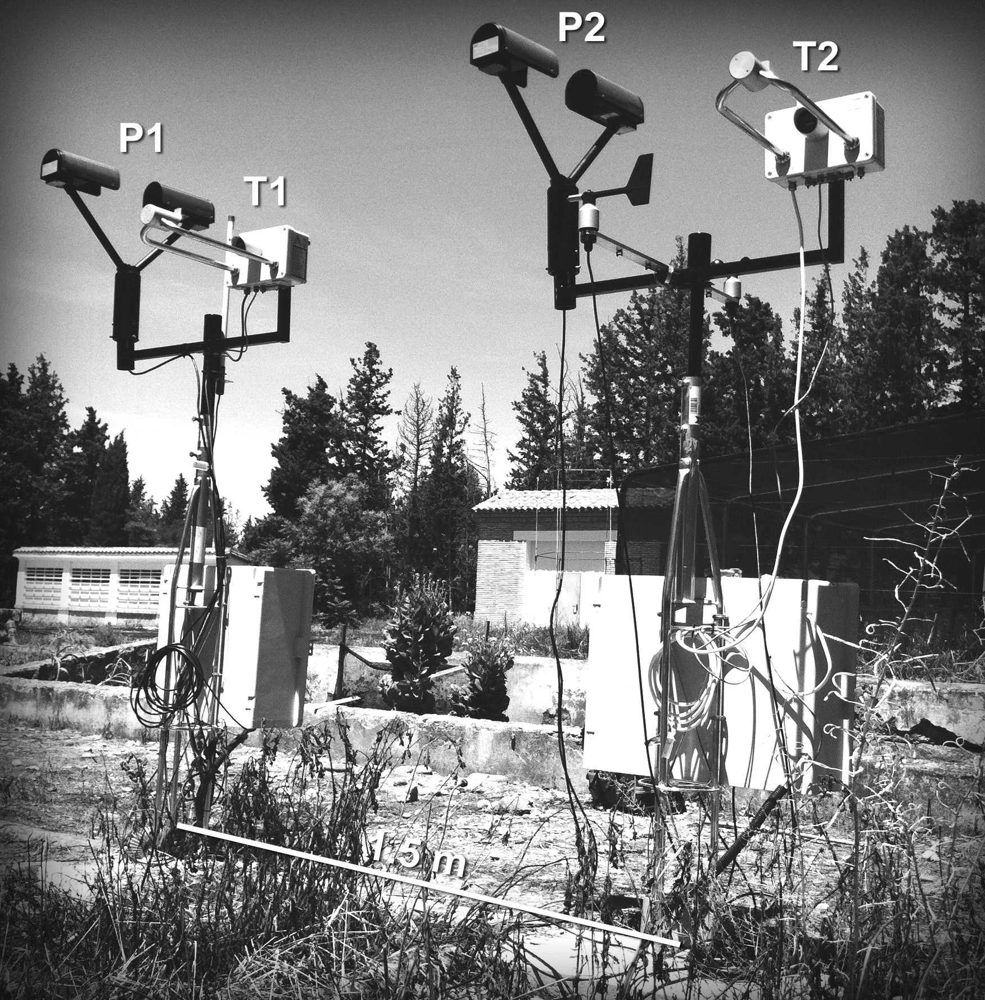

```{r setup, include=FALSE}
# global options
knitr::opts_chunk$set(echo = TRUE)

# packages
library(disdRo)
library(ggplot2)
library(cowplot)

library(lme4)

# a function to produce fancy scientific axis ticks
fancy_scientific <- function(l) {
     # turn in to character string in scientific notation
     l <- format(l, scientific = TRUE)
     # quote the part before the exponent to keep all the digits
     l <- gsub("^(.*)e", "'\\1'e", l)
     # turn the 'e+' into plotmath format
     l <- gsub("e", "%*%10^", l)
     #
     l <- gsub("^'1'%\\*%", "", l)
     l <- gsub("\\^\\+", "\\^",l)
     # return this as an expression
     parse(text=l)
}

# another function for formating text labels in plots
fmt_decimals <- function(decimals=0, width=NULL){
    function(x) format(x, nsmall=decimals, width=width, scientific=FALSE)
}
```

------

# Introduction and dataset


We analyze one-minute disdrometric data recorded by two Thies LPM and two
Parsivel2 disdrometers at the Aula Dei Experimental Station (41º43’30”N,
0º48’39”W, 230 m.a.s.l.), between 2013-06-17 and 2015-07-21. The disdrometers
where installed on two masts with a separation of 1.5 m between them (Figure 1).

<center>

</center>

A total of 510 events were recorded during that period, spanning between 5 and
1454 minutes. This sums up to ~75k to ~99k one-minute records, depending on the
device (see main article, Table 3).

The dataset analysed here corresponds to the common minutes, defined as those
having high quality data and detection of rainfall particles in each of the four
disdrometers (see main article, secion 2.3). This led to a total of 46,636
records, corresponding to 11,659 minutes belonging to 157 rainfall episodes.

We shall start by reading and formatting the dataset. There are two alternative
datasets:
* file [./data/data.csv.gz](./data/data.csv.gz), with variables as measured by
devices and calculated from the particle size and velocity (PSVD) data, after
a filtering and correction procedure was applied to the raw PSVD data to remove
ulikely particle size and velocity bins (see main article, section 2.2);
* file [./data/data_unfiltered.csv.gz](./data/data_unfiltered.csv.gz), as the
previous one but using the raw PSVD data (i.e., with no filtering and
correction).

The first dataset will be stored in object 'dat', while the second dataset
will be stored in object 'datunf'.


```{r prepareData1, include=TRUE}
# load data (filtered dataset)
dat <- read.table('./data/data.csv.gz', sep=',', head=TRUE)

# format factors
dat$Event <- as.factor(dat$Event)
dat$ID <- factor(dat$ID, levels=c('T1','T2','P1','P2'))
dat$Type <- factor(dat$Type)

# format time
dat$Time <- strptime(dat$Time, format='%Y-%m-%d %H:%M:%S')

head(dat)
```

```{r prepareData2, include=TRUE}
# load data (unfiltered dataset)
datunf <- read.table('./data/data_unfiltered.csv.gz', sep=',', head=TRUE)

# format factors
datunf$Event <- as.factor(datunf$Event)
datunf$ID <- factor(datunf$ID, levels=c('T1','T2','P1','P2'))
datunf$Type <- factor(datunf$Type)

# format time
datunf$Time <- strptime(datunf$Time, format='%Y-%m-%d %H:%M:%S')

head(datunf)
```

These are the variables included in the datasets:

|var    |full name                                     |units    |
|:------|:---------------------------------------------|---------|
|Time |time of the record |Y-m-d hh:mm:ss |
|Event |event ID |(factor)|
|ID | disdromter ID |(factor: T1, T2, P1, P2)|
|Serial |disdrometer serial number |(factor)|
|Type |disdrometer type |(factor: Thi, Par)|
|Mast |mast ID |(factor: 1, 2)|
|NP_meas |number of particles detected | (-)|
|R_meas |rainfall intensity, as outputted by the device | $mm\ h^{-1}$|
|Z_meas |radar reflectivity, as outputted by the device | $dB\ mm^6\ m^{-3}$|
|E_meas |erosivity, as outputted by the device | $J\ m^{-2}\ mm^{-1}$|
|Pcum_meas |cumulative rainfall amount | $mm$|
|Ecum_meas |cumulative kinetic energy | $J\ m^{-2}\ mm^{-1}$|
|NP |number of particles detected | (-)|
|ND |particle density | $m^{-3}\ mm^{-1}$|
|R |rainfall intensity | $mm\ h^{-1}$|
|P |rainfall amount | $mm$|
|Z |radar reflectivity | $dB\ mm^6\ m^{-3}$|
|M |water content | $g m^{-3}$|
|E |kinetic energy | $J\ m^{-2}\ mm^{-1}$|
|Pcum |cumulative rainfall amount | $mm$|
|Ecum |cumulative kinetic energy | $J\ m^{-2}\ mm^{-1}$|
|D10 |drop diameter's 10th percentile | $mm$|
|D25 |drop diameter's 25th percentile | $mm$|
|D50 |drop diameter's 50th percentile | $mm$|
|D75 |drop diameter's 75th percentile | $mm$|
|D90 |drop diameter's 90th percentile | $mm$|
|Dm  |mean drop diameter | $mm$|
|V10 |drop velocity's 10th percentile | $m\ s^{-1}$|
|V25 |drop velocity's 25th percentile | $m\ s^{-1}$|
|V50 |drop velocity's 50th percentile | $m\ s^{-1}$|
|V75 |drop velocity's 75th percentile | $m\ s^{-1}$|
|V90 |drop velocity's 90th percentile | $m\ s^{-1}$|
|Vm |mean drop velocity | $m\ s^{-1}$|


-----

# Exploratory analysis

With the objective of comparing the behaviour of the two disdrometer types
for several variables, we use different plotting tools for a first, exploratory,
analysis. Different colors and linetypes will be used to discriminate between
measuring devices.


## Cumulative variables

Time series of cumulative precipitation and kinetic energy over the whole
experiment. The internally computed values (measured) are compared to those
calculated from the PSVD (calculated). We will produce plots for both filtered
and unfiltered data.

**Filtered data**

```{r cumulativesFilt, echo=FALSE, message=FALSE, warning=FALSE, fig.height=10, fig.width=12}
p <- ggplot(dat, aes(Time, ND, color=ID, linetype=ID)) +
  scale_x_datetime() +
  scale_color_manual(name='Device', values=c('tomato','tomato','turquoise3','turquoise3')) +
#  scale_colour_manual(name='Device', values=c('grey48','grey48','black','black')) +
  scale_linetype_manual(name='Device', values=c('solid','dashed','solid','dashed')) +
  theme_bw()

p1 <- p + geom_line(aes(y=Pcum_meas)) +
  ylab('P (mm)') +
  ylim(c(0,250)) +
  ggtitle('Cumulative precipitation (measured)')

p2 <- p + geom_line(aes(y=Pcum)) +
  ylab('P (mm)') +
  ylim(c(0,250)) +
  ggtitle('Cumulative precipitation (calculated)')

p3 <- p + geom_line(aes(y=Ecum_meas)) +
  ylab('E (J m-2 mm-1)') +
  ylim(c(0,2200)) +
  ggtitle('Cumulative kinetic energy (measured)')

p4 <- p + geom_line(aes(y=Ecum)) +
  ylab('E (J m-2 mm-1)') +
  ylim(c(0,2200)) +
  ggtitle('Cumulative kinetic energy (calculated)')

pp <- plot_grid(p1, p2, p3, p4, ncol=2, align='v')
#save_plot('./plots/acum_pre_e.pdf', pp, base_height=10, base_width=12)
pp
```

**Unfiltered data**

```{r cumulativesUnfilt, echo=FALSE, message=FALSE, warning=FALSE, fig.height=10, fig.width=12}
p <- ggplot(datunf, aes(Time, ND, color=ID, linetype=ID)) +
  scale_x_datetime() +
  scale_color_manual(name='Device', values=c('tomato','tomato','turquoise3','turquoise3')) +
#  scale_colour_manual(name='Device', values=c('grey48','grey48','black','black')) +
  scale_linetype_manual(name='Device', values=c('solid','dashed','solid','dashed')) +
  theme_bw()

p1 <- p + geom_line(aes(y=Pcum_meas)) +
  ylab('P (mm)') +
  ylim(c(0,250)) +
  ggtitle('Cumulative precipitation (measured)')

p2 <- p + geom_line(aes(y=Pcum)) +
  ylab('P (mm)') +
  ylim(c(0,250)) +
  ggtitle('Cumulative precipitation (calculated)')

p3 <- p + geom_line(aes(y=Ecum_meas)) +
  ylab('E (J m-2 mm-1)') +
  ylim(c(0,2200)) +
  ggtitle('Cumulative kinetic energy (measured)')

p4 <- p + geom_line(aes(y=Ecum)) +
  ylab('E (J m-2 mm-1)') +
  ylim(c(0,2200)) +
  ggtitle('Cumulative kinetic energy (calculated)')

pp <- plot_grid(p1, p2, p3, p4, ncol=2, align='v')
pp
```


## Density plots, all minutes

We will now have a look at the kernel densities of the integrated variables. All
the minute records will be included in the plot.

**Filtered data**

```{r kernelDensities, echo=FALSE, message=FALSE, warning=FALSE, fig.height=8, fig.width=12}
dat_m <- melt(dat[,-c(1)])

w <- which(dat_m$variable %in% c('R','ND','Z','E'))
p1 <- ggplot(dat_m[w,], aes(x=value, color=ID, linetype=ID)) +
  geom_density() +
  scale_color_manual(name='Device', values=c('tomato','tomato','turquoise3','turquoise3')) +
#  scale_colour_manual(name='Device', values=c('grey48','grey48','black','black')) +
  scale_linetype_manual(name='Device', values = c('solid','dashed','solid','dashed')) +
  scale_x_log10(labels=fancy_scientific) +
  scale_y_continuous(labels=fmt_decimals(2)) +
  facet_wrap(~variable, ncol=4, scales='free') +
  xlab('') + ylab('') + theme_bw()

w <- which(dat_m$variable %in% c('D10','D50','D90','Dm'))
p2 <- ggplot(dat_m[w,], aes(x=value, color=ID, linetype=ID)) +
  geom_density() +
  scale_color_manual(name='Device', values=c('tomato','tomato','turquoise3','turquoise3')) +
#  scale_colour_manual(name='Device', values=c('grey48','grey48','black','black')) +
  scale_linetype_manual(name='Device', values = c('solid','dashed','solid','dashed')) +
  scale_y_continuous(labels=fmt_decimals(2)) +
  facet_wrap(~variable, ncol=4, scales='free') +
  xlab('') + ylab('') + theme_bw()

w <- which(dat_m$variable %in% c('V10','V50','V90', 'Vm'))
p3 <- ggplot(dat_m[w,], aes(x=value, color=ID, linetype=ID)) +
  geom_density() +
  scale_color_manual(name='Device', values=c('tomato','tomato','turquoise3','turquoise3')) +
#  scale_colour_manual(name='Device', values=c('grey48','grey48','black','black')) +
  scale_linetype_manual(name='Device', values = c('solid','dashed','solid','dashed')) +
  scale_y_continuous(labels=fmt_decimals(2)) +
  facet_wrap(~variable, ncol=4, scales='free') +
  xlab('') + ylab('') + theme_bw()

p0 <- plot_grid(p1, p2, p3, nrow=3, align='v')
#save_plot('./plots/dens_minute.pdf', p0, base_height=8, base_width=12)
p0
```

**Unfiltered data**

```{r kernelDensitiesUnf, echo=FALSE, message=FALSE, warning=FALSE, fig.height=8, fig.width=12}
dat_m <- melt(datunf[,-c(1)])

w <- which(dat_m$variable %in% c('R','ND','Z','E'))
p1 <- ggplot(dat_m[w,], aes(x=value, color=ID, linetype=ID)) +
  geom_density() +
  scale_color_manual(name='Device', values=c('tomato','tomato','turquoise3','turquoise3')) +
#  scale_colour_manual(name='Device', values=c('grey48','grey48','black','black')) +
  scale_linetype_manual(name='Device', values = c('solid','dashed','solid','dashed')) +
  scale_x_log10(labels=fancy_scientific) +
  scale_y_continuous(labels=fmt_decimals(2)) +
  facet_wrap(~variable, ncol=4, scales='free') +
  xlab('') + ylab('') + theme_bw()

w <- which(dat_m$variable %in% c('D10','D50','D90','Dm'))
p2 <- ggplot(dat_m[w,], aes(x=value, color=ID, linetype=ID)) +
  geom_density() +
  scale_color_manual(name='Device', values=c('tomato','tomato','turquoise3','turquoise3')) +
#  scale_colour_manual(name='Device', values=c('grey48','grey48','black','black')) +
  scale_linetype_manual(name='Device', values = c('solid','dashed','solid','dashed')) +
  scale_y_continuous(labels=fmt_decimals(2)) +
  facet_wrap(~variable, ncol=4, scales='free') +
  xlab('') + ylab('') + theme_bw()

w <- which(dat_m$variable %in% c('V10','V50','V90', 'Vm'))
p3 <- ggplot(dat_m[w,], aes(x=value, color=ID, linetype=ID)) +
  geom_density() +
  scale_color_manual(name='Device', values=c('tomato','tomato','turquoise3','turquoise3')) +
#  scale_colour_manual(name='Device', values=c('grey48','grey48','black','black')) +
  scale_linetype_manual(name='Device', values = c('solid','dashed','solid','dashed')) +
  scale_y_continuous(labels=fmt_decimals(2)) +
  facet_wrap(~variable, ncol=4, scales='free') +
  xlab('') + ylab('') + theme_bw()

p0 <- plot_grid(p1, p2, p3, nrow=3, align='v')
#save_plot('./plots/dens_minute_unfiltered.pdf', p0, base_height=8, base_width=12)
p0
```


## Violin plots

The same, but with violin plots (might be easier to read to some),

**Filtered data**

```{r violinPlots, echo=FALSE, message=FALSE, warning=FALSE, fig.height=8, fig.width=12}
dat_m <- melt(dat[,-c(1)])

w <- which(dat_m$variable %in% c('R','ND','Z','E'))
p1 <- ggplot(dat_m[w,], aes(x=ID, y=value)) +
  geom_violin(draw_quantiles=0.5) +
  facet_wrap(~variable, ncol=4, scales='free') +
  scale_y_log10(labels=fancy_scientific) +
  xlab('') + ylab('') + theme_bw()

w <- which(dat_m$variable %in% c('D10','D50','D90','Dm'))
p2 <- ggplot(dat_m[w,], aes(x=ID, y=value)) +
  geom_violin(draw_quantiles=0.5) +
  facet_wrap(~variable, ncol=4, scales='free') +
  scale_y_continuous(labels=fmt_decimals(width=6)) +
  xlab('') + ylab('') + theme_bw() 

w <- which(dat_m$variable %in% c('V10','V50','V90', 'Vm'))
p3 <- ggplot(dat_m[w,], aes(x=ID, y=value)) +
  geom_violin(draw_quantiles=0.5) +
  facet_wrap(~variable, ncol=4, scales='free') +
  scale_y_continuous(labels=fmt_decimals(width=6)) +
  xlab('') + ylab('') + theme_bw()

p0 <- plot_grid(p1, p2, p3, nrow=3, align='v')
#save_plot('./plots/violin_minute.pdf', p0, base_height=8, base_width=12)
p0
```

**Unfiltered data**

```{r violinPlotsUnf, echo=FALSE, message=FALSE, warning=FALSE, fig.height=8, fig.width=12}
dat_m <- melt(datunf[,-c(1)])

w <- which(dat_m$variable %in% c('R','ND','Z','E'))
p1 <- ggplot(dat_m[w,], aes(x=ID, y=value)) +
  geom_violin(draw_quantiles=0.5) +
  facet_wrap(~variable, ncol=4, scales='free') +
  scale_y_log10(labels=fancy_scientific) +
  xlab('') + ylab('') + theme_bw()

w <- which(dat_m$variable %in% c('D10','D50','D90','Dm'))
p2 <- ggplot(dat_m[w,], aes(x=ID, y=value)) +
  geom_violin(draw_quantiles=0.5) +
  facet_wrap(~variable, ncol=4, scales='free') +
  scale_y_continuous(labels=fmt_decimals(width=6)) +
  xlab('') + ylab('') + theme_bw() 

w <- which(dat_m$variable %in% c('V10','V50','V90', 'Vm'))
p3 <- ggplot(dat_m[w,], aes(x=ID, y=value)) +
  geom_violin(draw_quantiles=0.5) +
  facet_wrap(~variable, ncol=4, scales='free') +
  scale_y_continuous(labels=fmt_decimals(width=6)) +
  xlab('') + ylab('') + theme_bw()

p0 <- plot_grid(p1, p2, p3, nrow=3, align='v')
p0
```


## Density plots, by intensity ranges

We will repeat now the kernel density plots, but discriminating between low,
medium and high precipitation intensity.

**0.1 mm/h < R < 2 mm/h; N = 52306**

```{r Intensity1, echo=FALSE, message=FALSE, warning=FALSE, fig.height=8, fig.width=12}
dat_m <- melt(dat[dat$R>0.1 & dat$R<2,-c(1)])

w <- which(dat_m$variable %in% c('R','ND','Z','E'))
p1 <- ggplot(dat_m[w,], aes(x=value, color=ID, linetype=ID)) +
  geom_density() +
  scale_color_manual(name='Device', values=c('tomato','tomato','turquoise3','turquoise3')) +
#  scale_colour_manual(name='Device', values=c('grey48','grey48','black','black')) +
  scale_linetype_manual(name='Device', values = c('solid','dashed','solid','dashed')) +
  scale_x_log10(labels=fancy_scientific) +
  scale_y_continuous(labels=fmt_decimals(2)) +
  facet_wrap(~variable, ncol=4, scales='free') +
  xlab('') + ylab('') + theme_bw()

w <- which(dat_m$variable %in% c('D10','D50','D90','Dm'))
p2 <- ggplot(dat_m[w,], aes(x=value, color=ID, linetype=ID)) +
  geom_density() +
  scale_color_manual(name='Device', values=c('tomato','tomato','turquoise3','turquoise3')) +
#  scale_colour_manual(name='Device', values=c('grey48','grey48','black','black')) +
  scale_linetype_manual(name='Device', values = c('solid','dashed','solid','dashed')) +
  scale_y_continuous(labels=fmt_decimals(2)) +
  facet_wrap(~variable, ncol=4, scales='free') +
  xlab('') + ylab('') + theme_bw()

w <- which(dat_m$variable %in% c('V10','V50','V90', 'Vm'))
p3 <- ggplot(dat_m[w,], aes(x=value, color=ID, linetype=ID)) +
  geom_density() +
  scale_color_manual(name='Device', values=c('tomato','tomato','turquoise3','turquoise3')) +
#  scale_colour_manual(name='Device', values=c('grey48','grey48','black','black')) +
  scale_linetype_manual(name='Device', values = c('solid','dashed','solid','dashed')) +
  scale_y_continuous(labels=fmt_decimals(2)) +
  facet_wrap(~variable, ncol=4, scales='free') +
  xlab('') + ylab('') + theme_bw()

p0 <- plot_grid(p1, p2, p3, nrow=3, align='v')
#save_plot('./plots/dens_minute_intens1.pdf', p0, base_height=8, base_width=12)
p0

# w <- which(dat_m$variable %in% c('R','ND','Z','E'))
# p1 <- ggplot(dat_m[w,], aes(x=ID, y=value)) +
#   geom_violin(draw_quantiles=0.5) +
#   facet_wrap(~variable, ncol=4, scales='free') +
#   scale_y_log10(labels=fmt_decimals(width=5)) +
#   xlab('') + ylab('') + theme_bw()
# 
# w <- which(dat_m$variable %in% c('D10','D50','D90','Dm'))
# p2 <- ggplot(dat_m[w,], aes(x=ID, y=value)) +
#   geom_violin(draw_quantiles=0.5) +
#   facet_wrap(~variable, ncol=4, scales='free') +
#   scale_y_continuous(labels=fmt_decimals(width=5)) +
#   xlab('') + ylab('') + theme_bw() 
# 
# w <- which(dat_m$variable %in% c('V10','V50','V90', 'Vm'))
# p3 <- ggplot(dat_m[w,], aes(x=ID, y=value)) +
#   geom_violin(draw_quantiles=0.5) +
#   facet_wrap(~variable, ncol=4, scales='free') +
#   scale_y_continuous(labels=fmt_decimals(width=5)) +
#   xlab('') + ylab('') + theme_bw() 
# 
# p0 <- plot_grid(p1, p2, p3, nrow=3, align='v')
#save_plot('./plots/violin_minute_intens1.pdf', p0, base_height=8, base_width=12)
```

**2 mm/h < R < 10 mm/h; N = 6954**

```{r Intensity2, echo=FALSE, message=FALSE, warning=FALSE, fig.height=8, fig.width=12}
dat_m <- melt(dat[dat$R>2 & dat$R<10,-c(1)])

w <- which(dat_m$variable %in% c('R','ND','Z','E'))
p1 <- ggplot(dat_m[w,], aes(x=value, color=ID, linetype=ID)) +
  geom_density() +
  scale_color_manual(name='Device', values=c('tomato','tomato','turquoise3','turquoise3')) +
#  scale_colour_manual(name='Device', values=c('grey48','grey48','black','black')) +
  scale_linetype_manual(name='Device', values = c('solid','dashed','solid','dashed')) +
  scale_x_log10(labels=fancy_scientific) +
  scale_y_continuous(labels=fmt_decimals(2)) +
  facet_wrap(~variable, ncol=4, scales='free') +
  xlab('') + ylab('') + theme_bw()

w <- which(dat_m$variable %in% c('D10','D50','D90','Dm'))
p2 <- ggplot(dat_m[w,], aes(x=value, color=ID, linetype=ID)) +
  geom_density() +
  scale_color_manual(name='Device', values=c('tomato','tomato','turquoise3','turquoise3')) +
#  scale_colour_manual(name='Device', values=c('grey48','grey48','black','black')) +
  scale_linetype_manual(name='Device', values = c('solid','dashed','solid','dashed')) +
  scale_y_continuous(labels=fmt_decimals(2)) +
  facet_wrap(~variable, ncol=4, scales='free') +
  xlab('') + ylab('') + theme_bw()

w <- which(dat_m$variable %in% c('V10','V50','V90', 'Vm'))
p3 <- ggplot(dat_m[w,], aes(x=value, color=ID, linetype=ID)) +
  geom_density() +
  scale_color_manual(name='Device', values=c('tomato','tomato','turquoise3','turquoise3')) +
#  scale_colour_manual(name='Device', values=c('grey48','grey48','black','black')) +
  scale_linetype_manual(name='Device', values = c('solid','dashed','solid','dashed')) +
  scale_y_continuous(labels=fmt_decimals(2)) +
  facet_wrap(~variable, ncol=4, scales='free') +
  xlab('') + ylab('') + theme_bw()

p0 <- plot_grid(p1, p2, p3, nrow=3, align='v')
#save_plot('./plots/dens_minute_intens2.pdf', p0, base_height=8, base_width=12)
p0

# w <- which(dat_m$variable %in% c('R','ND','Z','E'))
# p1 <- ggplot(dat_m[w,], aes(x=ID, y=value)) +
#   geom_violin(draw_quantiles=0.5) +
#   facet_wrap(~variable, ncol=4, scales='free') +
#   scale_y_log10(labels=fmt_decimals(width=5)) +
#   xlab('') + ylab('') + theme_bw()
# 
# w <- which(dat_m$variable %in% c('D10','D50','D90','Dm'))
# p2 <- ggplot(dat_m[w,], aes(x=ID, y=value)) +
#   geom_violin(draw_quantiles=0.5) +
#   facet_wrap(~variable, ncol=4, scales='free') +
#   scale_y_continuous(labels=fmt_decimals(width=5)) +
#   xlab('') + ylab('') + theme_bw()
# 
# w <- which(dat_m$variable %in% c('V10','V50','V90', 'Vm'))
# p3 <- ggplot(dat_m[w,], aes(x=ID, y=value)) +
#   geom_violin(draw_quantiles=0.5) +
#   facet_wrap(~variable, ncol=4, scales='free') +
#   scale_y_continuous(labels=fmt_decimals(width=5)) +
#   xlab('') + ylab('') + theme_bw()
# 
# p0 <- plot_grid(p1, p2, p3, nrow=3, align='v')
#save_plot('./plots/violin_minute_intens2.pdf', p0, base_height=8, base_width=12)
```

**R > 10 mm/h; N = 1377**

```{r Intensity3, echo=FALSE, message=FALSE, warning=FALSE, fig.height=8, fig.width=12}
dat_m <- melt(dat[dat$R>5 & dat$R<10,-c(1)])

w <- which(dat_m$variable %in% c('R','ND','Z','E'))
p1 <- ggplot(dat_m[w,], aes(x=value, color=ID, linetype=ID)) +
  geom_density() +
  scale_color_manual(name='Device', values=c('tomato','tomato','turquoise3','turquoise3')) +
#  scale_colour_manual(name='Device', values=c('grey48','grey48','black','black')) +
  scale_linetype_manual(name='Device', values = c('solid','dashed','solid','dashed')) +
  scale_x_log10(labels=fancy_scientific) +
  scale_y_continuous(labels=fmt_decimals(2)) +
  facet_wrap(~variable, ncol=4, scales='free') +
  xlab('') + ylab('') + theme_bw()

w <- which(dat_m$variable %in% c('D10','D50','D90','Dm'))
p2 <- ggplot(dat_m[w,], aes(x=value, color=ID, linetype=ID)) +
  geom_density() +
  scale_color_manual(name='Device', values=c('tomato','tomato','turquoise3','turquoise3')) +
#  scale_colour_manual(name='Device', values=c('grey48','grey48','black','black')) +
  scale_linetype_manual(name='Device', values = c('solid','dashed','solid','dashed')) +
  scale_y_continuous(labels=fmt_decimals(2)) +
  facet_wrap(~variable, ncol=4, scales='free') +
  xlab('') + ylab('') + theme_bw()

w <- which(dat_m$variable %in% c('V10','V50','V90', 'Vm'))
p3 <- ggplot(dat_m[w,], aes(x=value, color=ID, linetype=ID)) +
  geom_density() +
  scale_color_manual(name='Device', values=c('tomato','tomato','turquoise3','turquoise3')) +
#  scale_colour_manual(name='Device', values=c('grey48','grey48','black','black')) +
  scale_linetype_manual(name='Device', values = c('solid','dashed','solid','dashed')) +
  scale_y_continuous(labels=fmt_decimals(2)) +
  facet_wrap(~variable, ncol=4, scales='free') +
  xlab('') + ylab('') + theme_bw()

p0 <- plot_grid(p1, p2, p3, nrow=3, align='v')
#save_plot('./plots/dens_minute_intens3.pdf', p0, base_height=8, base_width=12)
p0

# w <- which(dat_m$variable %in% c('R','ND','Z','E'))
# p1 <- ggplot(dat_m[w,], aes(x=ID, y=value)) +
#   geom_violin(draw_quantiles=0.5) +
#   facet_wrap(~variable, ncol=4, scales='free') +
#   scale_y_log10(labels=fmt_decimals(width=5)) +
#   xlab('') + ylab('') + theme_bw()
# 
# w <- which(dat_m$variable %in% c('D10','D50','D90','Dm'))
# p2 <- ggplot(dat_m[w,], aes(x=ID, y=value)) +
#   geom_violin(draw_quantiles=0.5) +
#   facet_wrap(~variable, ncol=4, scales='free') +
#   scale_y_continuous(labels=fmt_decimals(width=5)) +
#   xlab('') + ylab('') + theme_bw()
# 
# w <- which(dat_m$variable %in% c('V10','V50','V90', 'Vm'))
# p3 <- ggplot(dat_m[w,], aes(x=ID, y=value)) +
#   geom_violin(draw_quantiles=0.5) +
#   facet_wrap(~variable, ncol=4, scales='free') +
#   scale_y_continuous(labels=fmt_decimals(width=5)) +
#   xlab('') + ylab('') + theme_bw()
# 
# p0 <- plot_grid(p1, p2, p3, nrow=3, align='v')
#save_plot('./plots/violin_minute_intens3.pdf', p0, base_height=8, base_width=12)
```


## Density plots, events

We will now make density plots as the previous ones, but for events (and not
minutes).

```{r createEvents, echo=FALSE, message=FALSE, warning=FALSE}
events <- data.frame(
  NPm = aggregate(NP ~ Event + ID, dat, mean)[,3],
  NPsd = aggregate(NP ~ Event + ID, dat, sd)[,3],
  Rm = aggregate(R ~ Event + ID, dat, mean)[,3],
  Rsd = aggregate(R ~ Event + ID, dat, sd)[,3],
  RM = aggregate(R ~ Event + ID, dat, max)[,3],
  Pcum = aggregate(P ~ Event + ID, dat, sum)[,3],
  Zm = aggregate(Z ~ Event + ID, dat, mean)[,3],
  Zsd = aggregate(Z ~ Event + ID, dat, sd)[,3],
  Em = aggregate(E ~ Event + ID, dat, mean)[,3],
  Esd = aggregate(E ~ Event + ID, dat, sd)[,3],
  EM = aggregate(E ~ Event + ID, dat, max)[,3],
  Ecum = aggregate(E ~ Event + ID, dat, sum)[,3],
  NDm = aggregate(ND ~ Event + ID, dat, mean)[,3],
  NDsd = aggregate(ND ~ Event + ID, dat, sd)[,3],
  D10m = aggregate(D10 ~ Event + ID, dat, mean)[,3],
  D10sd = aggregate(D10 ~ Event + ID, dat, sd)[,3],
  D25m = aggregate(D25 ~ Event + ID, dat, mean)[,3],
  D25sd = aggregate(D25 ~ Event + ID, dat, sd)[,3],
  D50m = aggregate(D50 ~ Event + ID, dat, mean)[,3],
  D50sd = aggregate(D50 ~ Event + ID, dat, sd)[,3],
  D75m = aggregate(D75 ~ Event + ID, dat, mean)[,3],
  D75sd = aggregate(D75 ~ Event + ID, dat, sd)[,3],
  D90m = aggregate(D90 ~ Event + ID, dat, mean)[,3],
  D90sd = aggregate(D90 ~ Event + ID, dat, sd)[,3],
  V10m = aggregate(V10 ~ Event + ID, dat, mean)[,3],
  V10sd = aggregate(V10 ~ Event + ID, dat, sd)[,3],
  V25m = aggregate(V25 ~ Event + ID, dat, mean)[,3],
  V25sd = aggregate(V25 ~ Event + ID, dat, sd)[,3],
  V50m = aggregate(V50 ~ Event + ID, dat, mean)[,3],
  V50sd = aggregate(V50 ~ Event + ID, dat, sd)[,3],
  V75m = aggregate(V75 ~ Event + ID, dat, mean)[,3],
  V75sd = aggregate(V75 ~ Event + ID, dat, sd)[,3],
  V90m = aggregate(V90 ~ Event + ID, dat, mean)[,3],
  V90sd = aggregate(V90 ~ Event + ID, dat, sd)[,3])
events$ev <- aggregate(R ~ Event + ID, dat, mean)[,1]
events$ID <- aggregate(R ~ Event + ID, dat, mean)[,2]
```

```{r kernelDensitiesEvents, echo=FALSE, message=FALSE, warning=FALSE, fig.height=8, fig.width=12}
dat_m <- melt(events)

w <- which(dat_m$variable %in% c('Rm','RM','Rsd','NDm'))
p1 <- ggplot(dat_m[w,], aes(x=value, color=ID, linetype=ID)) +
  geom_density() +
  scale_color_manual(name='Device', values=c('tomato','tomato','turquoise3','turquoise3')) +
#  scale_colour_manual(name='Device', values=c('grey48','grey48','black','black')) +
  scale_linetype_manual(name='Device', values = c('solid','dashed','solid','dashed')) +
  scale_x_log10(labels=fancy_scientific) +
  scale_y_continuous(labels=fmt_decimals(2)) +
  facet_wrap(~variable, ncol=4, scales='free') +
  xlab('') + ylab('') + theme_bw()

w <- which(dat_m$variable %in% c('D10m','D50m','D90m','Em'))
p2 <- ggplot(dat_m[w,], aes(x=value, color=ID, linetype=ID)) +
  geom_density() +
  scale_color_manual(name='Device', values=c('tomato','tomato','turquoise3','turquoise3')) +
#  scale_colour_manual(name='Device', values=c('grey48','grey48','black','black')) +
  scale_linetype_manual(name='Device', values = c('solid','dashed','solid','dashed')) +
  scale_y_continuous(labels=fmt_decimals(2)) +
  facet_wrap(~variable, ncol=4, scales='free') +
  xlab('') + ylab('') + theme_bw()

w <- which(dat_m$variable %in% c('V10m','V50m','V90m', 'Zm'))
p3 <- ggplot(dat_m[w,], aes(x=value, color=ID, linetype=ID)) +
  geom_density() +
  scale_color_manual(name='Device', values=c('tomato','tomato','turquoise3','turquoise3')) +
#  scale_colour_manual(name='Device', values=c('grey48','grey48','black','black')) +
  scale_linetype_manual(name='Device', values = c('solid','dashed','solid','dashed')) +
  scale_y_continuous(labels=fmt_decimals(2)) +
  facet_wrap(~variable, ncol=4, scales='free') +
  xlab('') + ylab('') + theme_bw()

p0 <- plot_grid(p1, p2, p3, nrow=3, align='v')
#save_plot('./plots/dens_events.pdf', p0, base_height=8, base_width=12)
p0

w <- which(dat_m$variable %in% c('Rm','RM','Rsd','NDm'))
p1 <- ggplot(dat_m[w,], aes(x=ID, y=value)) +
  geom_violin(draw_quantiles=0.5) +
  facet_wrap(~variable, ncol=4, scales='free') +
  scale_y_log10(labels=fancy_scientific) +
  xlab('') + ylab('') + theme_bw()

w <- which(dat_m$variable %in% c('D10m','D50m','D90m','Em'))
p2 <- ggplot(dat_m[w,], aes(x=ID, y=value)) +
  geom_violin(draw_quantiles=0.5) +
  facet_wrap(~variable, ncol=4, scales='free') +
  scale_y_continuous(labels=fmt_decimals(width=6)) +
  xlab('') + ylab('') + theme_bw() 

w <- which(dat_m$variable %in% c('V10m','V50m','V90m', 'Zm'))
p3 <- ggplot(dat_m[w,], aes(x=ID, y=value)) +
  geom_violin(draw_quantiles=0.5) +
  facet_wrap(~variable, ncol=4, scales='free') +
  scale_y_continuous(labels=fmt_decimals(width=6)) +
  xlab('') + ylab('') + theme_bw()

p0 <- plot_grid(p1, p2, p3, nrow=3, align='v')
#save_plot('./plots/dens_events.pdf', p0, base_height=8, base_width=12)
p0
```


-------------

# Analysis

We will use a Gamma Generalized Linear Mixed-Effects Model to compare between
the two disdrometer types, with the factor `Type` as fixed effect and the
factor `Mast` as random variable. For several dependet variables (ND, R, E)
we use a log link, while we use an identity link for the rest (Z, D10, D50, etc).


## Minute data, all intensities

```{r glmeAnalysis}
# take a random sample of 250 complete minutes x 4 devices = 1000
set.seed(12345)
smp <- names(which(table(as.character(dat$Time))==4))
smp <- sample(smp, 250) # times 4 = 1000 records
smp <- which(dat$Time %in% smp)

m_np <- glmer(NP ~ 0 + Type + (1|Mast), data=dat[smp,], Gamma(link='log'))
summary(m_np)
signif(exp(summary(m_np)$coeff[,1]),4)

m_d10 <- glmer(D10 ~ 0 + Type + (1|Mast), data=dat[smp,], Gamma(link='identity'))
summary(m_d10)
signif(summary(m_d10)$coeff[,1],4)

m_d50 <- glmer(D50 ~ 0 + Type + (1|Mast), data=dat[smp,], Gamma(link='identity'))
summary(m_d50)
signif(summary(m_d50)$coeff[,1],4)

m_d90 <- glmer(D90 ~ 0 + Type + (1|Mast), data=dat[smp,], Gamma(link='identity'))
summary(m_d90)
signif(summary(m_d90)$coeff[,1],4)

m_v10 <- glmer(V10 ~ 0 + Type + (1|Mast), data=dat[smp,], Gamma(link='identity'))
summary(m_v10)
signif(summary(m_v10)$coeff[,1],4)

m_v50 <- glmer(V50 ~ 0 + Type + (1|Mast), data=dat[smp,], Gamma(link='identity'))
summary(m_v50)
signif(summary(m_v50)$coeff[,1],4)

m_v90 <- glmer(V90 ~ 0 + Type + (1|Mast), data=dat[smp,], Gamma(link='identity'))
summary(m_v90)
signif(summary(m_v90)$coeff[,1],4)

m_nd <- glmer(ND ~ 0 + Type + (1|Mast), data=dat[smp,], Gamma(link='log'))
summary(m_nd)
signif(exp(summary(m_nd)$coeff[,1]),4)

m_r <- glmer(R ~ 0 + Type + (1|Mast), data=dat[smp,], Gamma(link='log'))
summary(m_r)
signif(exp(summary(m_r)$coeff[,1]),4)

m_z <- glmer(Z ~ 0 + Type + (1|Mast), data=dat[smp,], Gamma(link='log'))
summary(m_z)
signif(exp(summary(m_z)$coeff[,1]),4)

m_e <- glmer(E ~ 0 + Type + (1|Mast), data=dat[smp,], Gamma(link='log'))
summary(m_e)
signif(exp(summary(m_e)$coeff[,1]),4)

# pars <- rbind(c(summary(m_r)$co[c(1,2),1],summary(m_r)$co[1,2]),
#               c(summary(m_e)$co[c(1,2),1],summary(m_e)$co[1,2]))
# rownames(pars) <- c('r','e')
# kable(pars, digits=4,
#       col.names=c('Parsivel','Thies','st. error'))
```


## Minute data, low intensities

```{r glmeAnalysis2}
set.seed(12345)
w <- dat$R>0.1 & dat$R<2
smp <- names(which(table(as.character(dat$Time[w]))==4))
smp <- sample(smp, 250)
smp <- which(dat$Time %in% smp)

m_np <- glmer(NP ~ 0 + Type + (1|Mast), data=dat[smp,], Gamma(link='log'))
summary(m_np)
signif(exp(summary(m_np)$coeff[,1]),4)

m_d10 <- glmer(D10 ~ 0 + Type + (1|Mast), data=dat[smp,], Gamma(link='identity'))
summary(m_d10)
signif(summary(m_d10)$coeff[,1],4)

m_d50 <- glmer(D50 ~ 0 + Type + (1|Mast), data=dat[smp,], Gamma(link='identity'))
summary(m_d50)
signif(summary(m_d50)$coeff[,1],4)

m_d90 <- glmer(D90 ~ 0 + Type + (1|Mast), data=dat[smp,], Gamma(link='identity'))
summary(m_d90)
signif(summary(m_d90)$coeff[,1],4)

m_v10 <- glmer(V10 ~ 0 + Type + (1|Mast), data=dat[smp,], Gamma(link='identity'))
summary(m_v10)
signif(summary(m_v10)$coeff[,1],4)

m_v50 <- glmer(V50 ~ 0 + Type + (1|Mast), data=dat[smp,], Gamma(link='identity'))
summary(m_v50)
signif(summary(m_v50)$coeff[,1],4)

m_v90 <- glmer(V90 ~ 0 + Type + (1|Mast), data=dat[smp,], Gamma(link='identity'))
summary(m_v90)
signif(summary(m_v90)$coeff[,1],4)

m_r <- glmer(R ~ 0 + Type + (1|Mast), data=dat[smp,], Gamma(link='log'))
summary(m_r)
signif(exp(summary(m_r)$coeff[,1]),4)

m_nd <- glmer(ND ~ 0 + Type + (1|Mast), data=dat[smp,], Gamma(link='log'))
summary(m_nd)
signif(exp(summary(m_nd)$coeff[,1]),4)

m_z <- glmer(Z ~ 0 + Type + (1|Mast), data=dat[smp,], Gamma(link='log'))
summary(m_z)
signif(exp(summary(m_z)$coeff[,1]),4)

m_e <- glmer(E ~ 0 + Type + (1|Mast), data=dat[smp,], Gamma(link='log'))
summary(m_e)
signif(exp(summary(m_e)$coeff[,1]),4)
```


## Minute data, medium intensities

```{r glmeAnalysis3}
set.seed(12345)
w <- dat$R>2 & dat$R<10
smp <- names(which(table(as.character(dat$Time[w]))==4))
smp <- sample(smp, 250)
smp <- which(dat$Time %in% smp)

m_np <- glmer(NP ~ 0 + Type + (1|Mast), data=dat[smp,], Gamma(link='log'))
summary(m_np)
signif(exp(summary(m_np)$coeff[,1]),4)

m_d10 <- glmer(D10 ~ 0 + Type + (1|Mast), data=dat[smp,], Gamma(link='identity'))
summary(m_d10)
signif(summary(m_d10)$coeff[,1],4)

m_d50 <- glmer(D50 ~ 0 + Type + (1|Mast), data=dat[smp,], Gamma(link='identity'))
summary(m_d50)
signif(summary(m_d50)$coeff[,1],4)

m_d90 <- glmer(D90 ~ 0 + Type + (1|Mast), data=dat[smp,], Gamma(link='identity'))
summary(m_d90)
signif(summary(m_d90)$coeff[,1],4)

m_v10 <- glmer(V10 ~ 0 + Type + (1|Mast), data=dat[smp,], Gamma(link='identity'))
summary(m_v10)
signif(summary(m_v10)$coeff[,1],4)

m_v50 <- glmer(V50 ~ 0 + Type + (1|Mast), data=dat[smp,], Gamma(link='identity'))
summary(m_v50)
signif(summary(m_v50)$coeff[,1],4)

m_v90 <- glmer(V90 ~ 0 + Type + (1|Mast), data=dat[smp,], Gamma(link='identity'))
summary(m_v90)
signif(summary(m_v90)$coeff[,1],4)

m_r <- glmer(R ~ 0 + Type + (1|Mast), data=dat[smp,], Gamma(link='log'))
summary(m_r)
signif(exp(summary(m_r)$coeff[,1]),4)

m_nd <- glmer(ND ~ 0 + Type + (1|Mast), data=dat[smp,], Gamma(link='log'))
summary(m_nd)
signif(exp(summary(m_nd)$coeff[,1]),4)

m_z <- glmer(Z ~ 0 + Type + (1|Mast), data=dat[smp,], Gamma(link='log'))
summary(m_z)
signif(exp(summary(m_z)$coeff[,1]),4)

m_e <- glmer(E ~ 0 + Type + (1|Mast), data=dat[smp,], Gamma(link='log'))
summary(m_e)
signif(exp(summary(m_e)$coeff[,1]),4)
```


## Minute data, high intensities

```{r glmeAnalysis4}
set.seed(12345)
w <- dat$R>10
smp <- names(which(table(as.character(dat$Time[w]))==4))
#smp <- sample(smp, 250)
smp <- which(dat$Time %in% smp)

m_np <- glmer(NP ~ 0 + Type + (1|Mast), data=dat[smp,], Gamma(link='log'))
summary(m_np)
signif(exp(summary(m_np)$coeff[,1]),4)

m_d10 <- glmer(D10 ~ 0 + Type + (1|Mast), data=dat[smp,], Gamma(link='identity'))
summary(m_d10)
signif(summary(m_d10)$coeff[,1],4)

m_d50 <- glmer(D50 ~ 0 + Type + (1|Mast), data=dat[smp,], Gamma(link='identity'))
summary(m_d50)
signif(summary(m_d50)$coeff[,1],4)

m_d90 <- glmer(D90 ~ 0 + Type + (1|Mast), data=dat[smp,], Gamma(link='identity'))
summary(m_d90)
signif(summary(m_d90)$coeff[,1],4)

m_v10 <- glmer(V10 ~ 0 + Type + (1|Mast), data=dat[smp,], Gamma(link='identity'))
summary(m_v10)
signif(summary(m_v10)$coeff[,1],4)

m_v50 <- glmer(V50 ~ 0 + Type + (1|Mast), data=dat[smp,], Gamma(link='identity'))
summary(m_v50)
signif(summary(m_v50)$coeff[,1],4)

m_v90 <- glmer(V90 ~ 0 + Type + (1|Mast), data=dat[smp,], Gamma(link='identity'))
summary(m_v90)
signif(summary(m_v90)$coeff[,1],4)

m_r <- glmer(R ~ 0 + Type + (1|Mast), data=dat[smp,], Gamma(link='log'))
summary(m_r)
signif(exp(summary(m_r)$coeff[,1]),4)

m_nd <- glmer(ND ~ 0 + Type + (1|Mast), data=dat[smp,], Gamma(link='log'))
summary(m_nd)
signif(exp(summary(m_nd)$coeff[,1]),4)

m_z <- glmer(Z ~ 0 + Type + (1|Mast), data=dat[smp,], Gamma(link='log'))
summary(m_z)
signif(exp(summary(m_z)$coeff[,1]),4)

m_e <- glmer(E ~ 0 + Type + (1|Mast), data=dat[smp,], Gamma(link='log'))
summary(m_e)
signif(exp(summary(m_e)$coeff[,1]),4)
```


## Event data

```{r glmeAnalysisEvent}
set.seed(12345)
smp <- names(which(table(as.character(events$ev))==4))
smp <- which(events$ev %in% smp)

events$Type <- as.factor(substr(events$ID, 1, 1))
events$Mast <- as.factor(substr(events$ID, 2, 2))

m_np <- glmer(NPm ~ 0 + Type + (1|Mast), data=events[smp,], Gamma(link='log'))
summary(m_np)
signif(exp(summary(m_np)$coeff[,1]),4)

m_d10m <- glmer(D10m ~ 0 + Type + (1|Mast), data=events[smp,], Gamma(link='identity'))
summary(m_d10m)
signif(summary(m_d10m)$coeff[,1],4)

m_d50m <- glmer(D50m ~ 0 + Type + (1|Mast), data=events[smp,], Gamma(link='identity'))
summary(m_d50m)
signif(summary(m_d50m)$coeff[,1],4)

m_d90m <- glmer(D90m ~ 0 + Type + (1|Mast), data=events[smp,], Gamma(link='identity'))
summary(m_d90m)
signif(summary(m_d90m)$coeff[,1],4)

m_v10 <- glmer(V10m ~ 0 + Type + (1|Mast), data=events[smp,], Gamma(link='identity'))
summary(m_v10)
signif(summary(m_v10)$coeff[,1],4)

m_v50m <- glmer(V50m ~ 0 + Type + (1|Mast), data=events[smp,], Gamma(link='identity'))
summary(m_v50m)
signif(summary(m_v50m)$coeff[,1],4)

m_v90m <- glmer(V90m ~ 0 + Type + (1|Mast), data=events[smp,], Gamma(link='identity'))
summary(m_v90m)
signif(summary(m_v90m)$coeff[,1],4)

m_rm <- glmer(Rm ~ 0 + Type + (1|Mast), data=events[smp,], Gamma(link='identity'))
summary(m_rm)
signif(summary(m_rm)$coeff[,1],4)

m_rmx <- glmer(RM ~ 0 + Type + (1|Mast), data=events[smp,], Gamma(link='identity'))
summary(m_rmx)
signif(summary(m_rmx)$coeff[,1],4)

m_nd <- glmer(NDm ~ 0 + Type + (1|Mast), data=events[smp,], Gamma(link='identity'))
summary(m_nd)
signif(summary(m_nd)$coeff[,1],4)

m_em <- glmer(Em ~ 0 + Type + (1|Mast), data=events[smp,], Gamma(link='identity'))
summary(m_em)
signif(summary(m_em)$coeff[,1],4)

m_zm <- glmer(Zm ~ 0 + Type + (1|Mast), data=events[smp,], Gamma(link='identity'))
summary(m_zm)
signif(summary(m_zm)$coeff[,1],4)
```


## Un-filtered data

```{r glmeAnalysisUnfiltered}
set.seed(12345)
smp <- names(which(table(as.character(datunf$Time))==4))
smp <- sample(smp, 250) # times 4 = 1000 records
smp <- which(datunf$Time %in% smp)

m_np <- glmer(NP_meas ~ 0 + Type + (1|Mast), data=datunf[smp,], Gamma(link='log'))
summary(m_np)
signif(exp(summary(m_np)$coeff[,1]),4)

m_r <- glmer(R ~ 0 + Type + (1|Mast), data=datunf[smp,], Gamma(link='log'))
summary(m_r)
signif(exp(summary(m_r)$coeff[,1]),4)

m_nd <- glmer(ND ~ 0 + Type + (1|Mast), data=datunf[smp,], Gamma(link='log'))
summary(m_nd)
signif(exp(summary(m_nd)$coeff[,1]),4)

m_z <- glmer(Z ~ 0 + Type + (1|Mast), data=datunf[smp,], Gamma(link='log'))
summary(m_z)
signif(exp(summary(m_z)$coeff[,1]),4)

m_e <- glmer(E ~ 0 + Type + (1|Mast), data=datunf[smp,], Gamma(link='log'))
summary(m_e)
signif(exp(summary(m_e)$coeff[,1]),4)

m_d10 <- glmer(D10 ~ 0 + Type + (1|Mast), data=datunf[smp,], Gamma(link='identity'))
summary(m_d10)
signif(summary(m_d10)$coeff[,1],4)

m_d50 <- glmer(D50 ~ 0 + Type + (1|Mast), data=datunf[smp,], Gamma(link='identity'))
summary(m_d50)
signif(summary(m_d50)$coeff[,1],4)

m_d90 <- glmer(D90 ~ 0 + Type + (1|Mast), data=datunf[smp,], Gamma(link='identity'))
summary(m_d90)
signif(summary(m_d90)$coeff[,1],4)

m_v10 <- glmer(V10 ~ 0 + Type + (1|Mast), data=datunf[smp,], Gamma(link='identity'))
summary(m_v10)
signif(summary(m_v10)$coeff[,1],4)

m_v50 <- glmer(V50 ~ 0 + Type + (1|Mast), data=datunf[smp,], Gamma(link='identity'))
summary(m_v50)
signif(summary(m_v50)$coeff[,1],4)

m_v90 <- glmer(V90 ~ 0 + Type + (1|Mast), data=datunf[smp,], Gamma(link='identity'))
summary(m_v90)
signif(summary(m_v90)$coeff[,1],4)
```


We shall finally try fiting a heteroskedastic model, using `glmmPQL` from the 
`MASS` package. This function fits a Generalized Linear Mixed Effects Model with
multivariate normal random effects, using Penalized Quasi-Likelihood.

```{r glmmPQLAnalysis}
# IT DOES NOT WORK
#library(nlme)
#library(MASS)
#glmmPQL(d50~0+Type, random=~1|Mast, family=Gamma(link='identity'),
#  data=dat[smp,], weights=varIdent(form=~1|Type))
```
